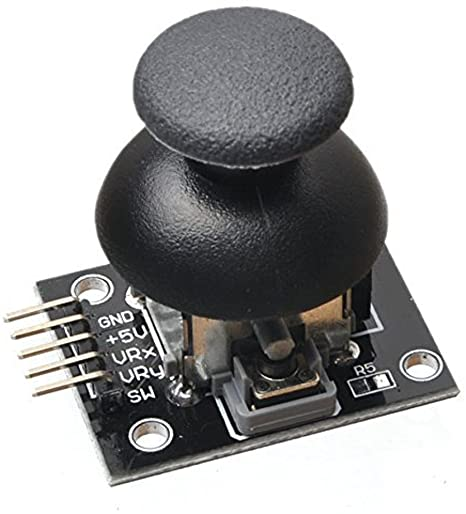

# Joystick ESP8266 y Micropython 
Vamos a programar un Joystick Elegoo con Micropython.

usando el rete-conocido microcontrolador Nodemcu esp-8266 de Expressiff

<a href=https://randomnerdtutorials.com/esp8266-pinout-reference-gpios/>Fotos y pinouts diferentes modelos esp8266 </a> para referencia

Tomado de este excelente blog <a href=https://orionrobots.co.uk/2017/05/28/joystick-attached-to-esp8266.html> Orion Robots</a> y adaptado al espanol para Micropython

EL diagrama basico del joystick es el siguiente.

Joystick X y Joystick Y Son dos potenciometros que envian datos analogos al mismo tiempo.
Pero el esp-8266 tiene la limitacion de que solo tiene una entrada analoga (ADC(0))
Una solucion seria usar un esp-32 que tiene 15 entradas analogas.  <a href=https://randomnerdtutorials.com/esp32-adc-analog-read-arduino-ide/>Ver este tutorial</a>
Pero si el microcontrolador que tenemos es esp-8266 pues no tenemos otra opcion que dividir las entradas de cada potenciometro y registrarlas por separado.
Una brillante solucion fue la que encontre en <a href=https://orionrobots.co.uk/2017/05/28/joystick-attached-to-esp8266.html> Orion Robots</a> y funciono a la perfeccion, como mi idioma de programacion favorito es Python, y Micropython decidi hacerlo y subirlo para ustedes.
La configuracion es la misma de las figuras que estan en <a href=https://orionrobots.co.uk/2017/05/28/joystick-attached-to-esp8266.html> Orion Robots</a>.

